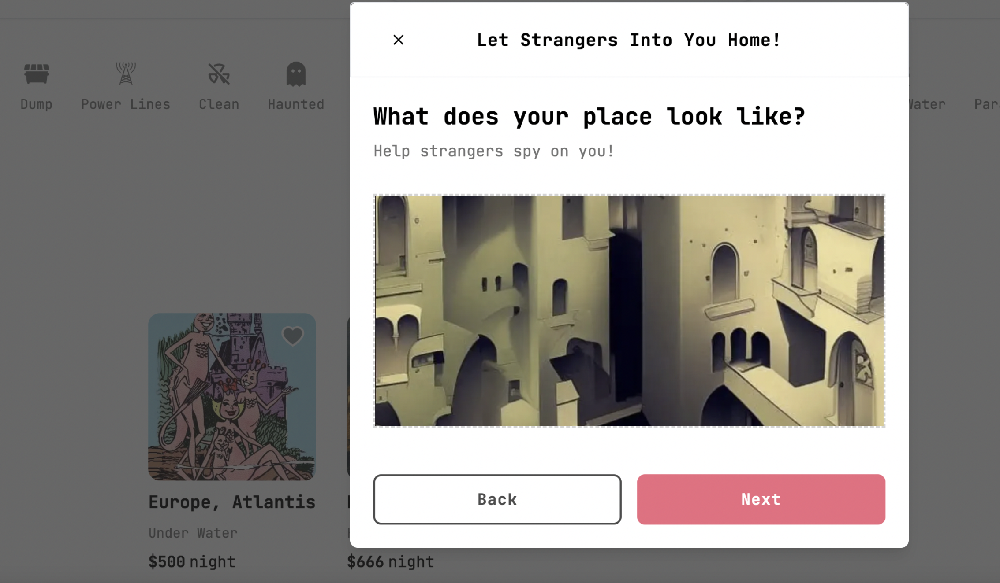

# AveBnB

This is an AirBnB clone I’m writing to teach myself Next.js and Tailwind.

# Features

## Search all your favorite familiar AirBnB categories!

## Post your properties!

## CI/CD with Github Actions

# Tests

`Yarn test` to run unit and integration tests. E2E coming soon.

# Getting Started

1. [Visit the app]( https://avebnb.vercel.app/)
1. Login from your Gmial or Github accounts or create a new account
1. Post properties to your heart’s content
