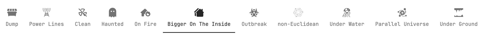
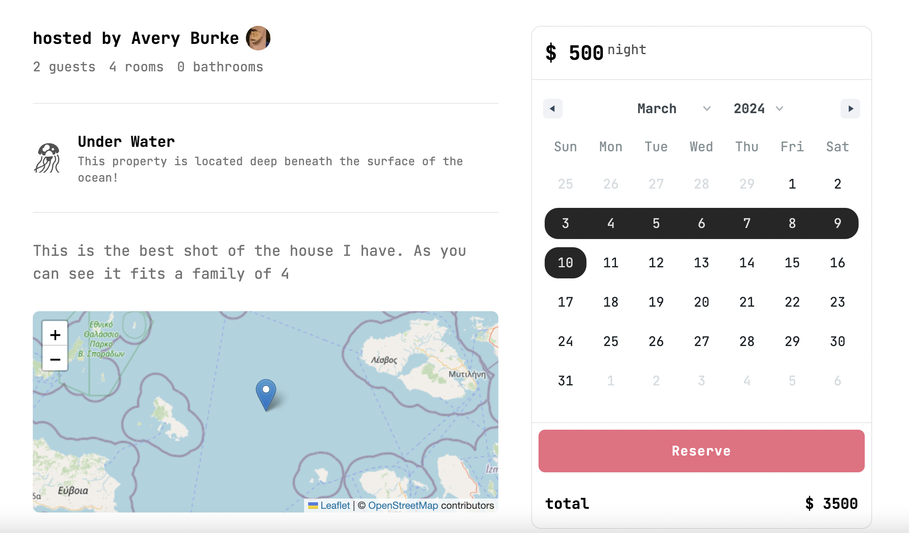

# AveBnB

This is an AirBnB clone I’m writing to teach myself Next.js and Tailwind.

## Features

### Stack

* Next.js 14
* Tailwind
* Prisma
* Auth.js
* PostgreSQL
* CI/CD with Github Actions

### Search all your favorite familiar AirBnB categories!

### Upload your properties!

### Book reservations!

### Tests

Run `Yarn test` for unit and integration tests. E2E coming soon.

# Getting Started

1. [Visit the app]( https://avebnb.vercel.app/)
1. Login from your Gmial or Github accounts or create a new account
1. Post properties to your heart’s content
